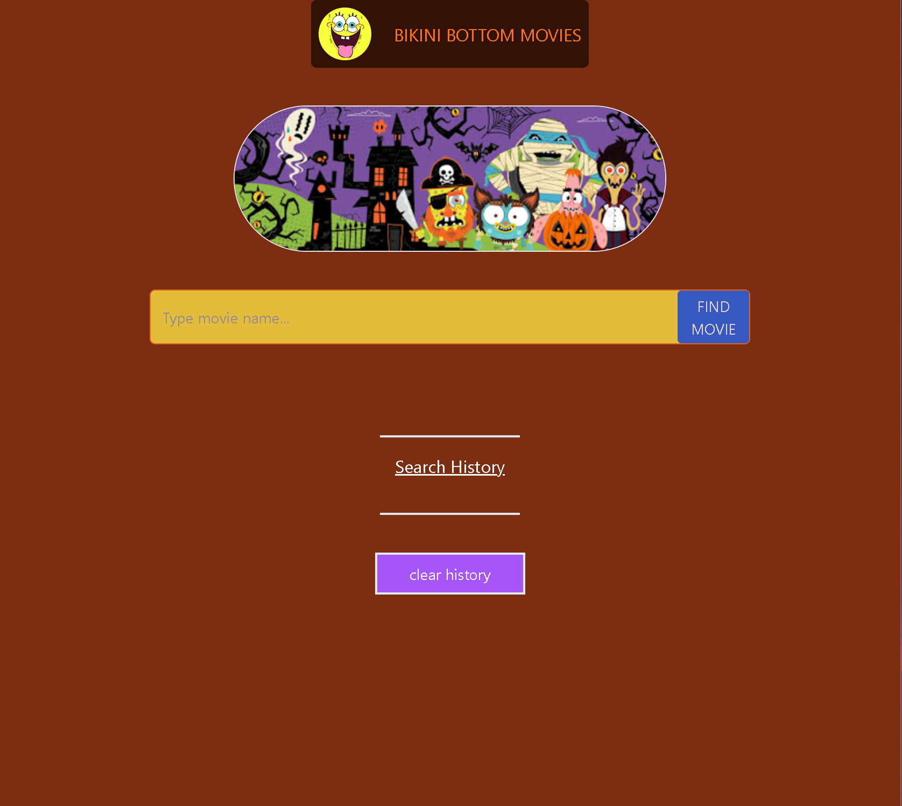
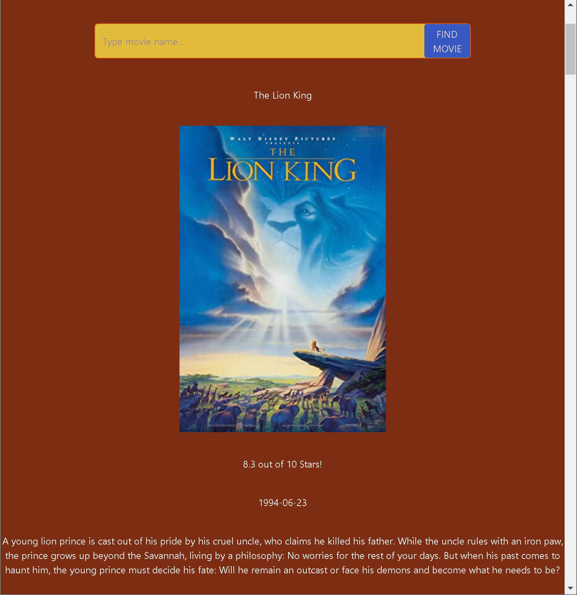
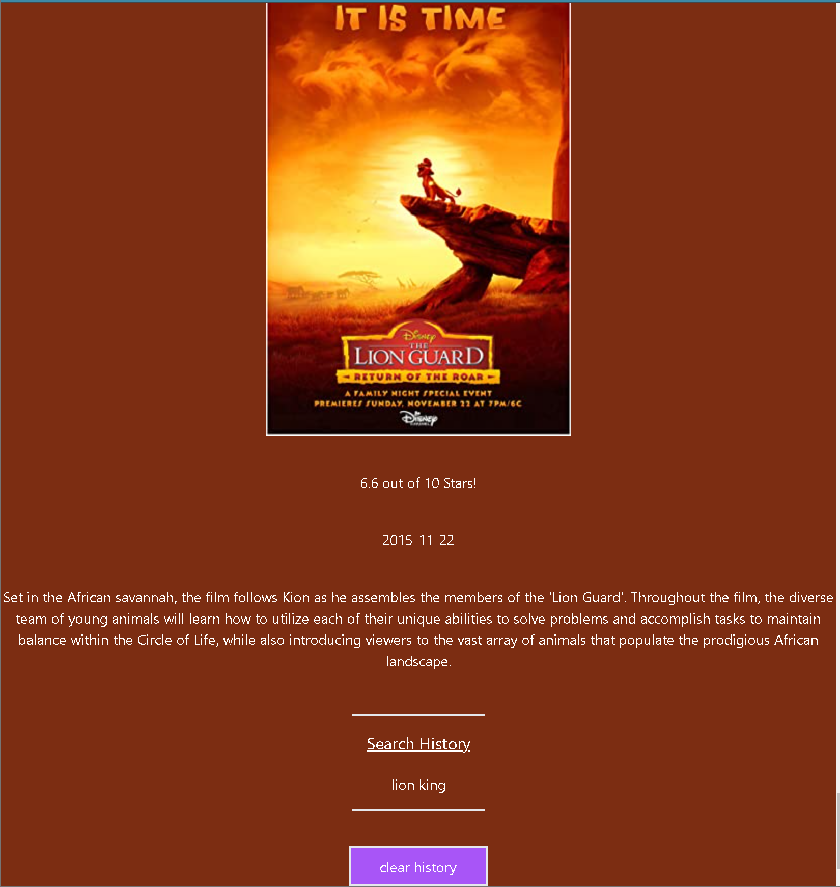

# Bikini-Bottom_Movie_Search

## Description
This project includes the following features that are required for the search results to work properly and that will be available when the search results are finished. The results are then returned to the user interface, either by synchronous or the async/await function which utilizes promises. These features are available when the search results are finished being retrieved from the API and the results are returned to the user interface using the aforementioned methods and properties of the search results object. These methods will be available when the search results are finished being retrieved from the API.

### [Click here to see the webpage!](https://em-t-shells.github.io/Bikini-Bottom_Farmers-Market/)

## Installation
Clone this repository to your desktop
Open the html file in your preferred browser

## Usage
To run the application, simply right click on the index.html file and click open with live server or preferred browser options.
To see any changes you may desire to experiment with and see in real time, use the live server option.
Simply type in a valid movie into the search bar and click on the Find Movie button.

## App Screenshots

## Reflection
In hindsight, the functional aspect of the application was utilized in a straightforward manner. Once a fundamental understanding of the necessary methods is acquired, the logic under the hood will become self-evident. To my surprise, I felt most hindered in my productivity by Tailwind's CSS framework. Though, it provides a wide range of utilities and is practically similar to boostrap, its understandable as to why it is such a well respected tool. Unlike bootstrap however, do not expect to feel any producible competence within a few days. It is a powerful framework that deserves a little extra time spent becoming genuinely familiar with prior to any sort of short term project.

### Resources:
https://tailwindcss.com/

https://cferreirasuazo.medium.com/getting-movie-data-from-omdbapi-using-fetch-f2b96ae230dd

https://developer.mozilla.org/en-US/docs/Web/API/Document/createElement

https://javascript.info/async-await

#
### Curators: G.E. Taskale, C. Getchell, C. Francis, W. Chowdhury, D. Riahi
###
#

###
###